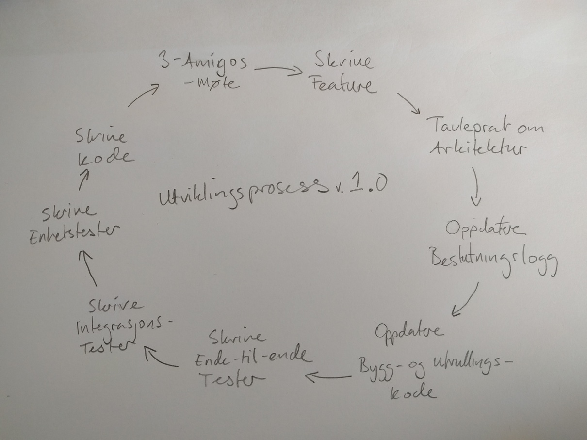

# Autoritetsregister for verk

# Utkast

## SIPOC

Her bruker jeg ordet "biblioteksystem" ukritisk, det kunne like gjerne bare vært "tredjepartsdatakonsumentapplikasjon"

| Supplier | Input | Process | Output | Customer |
|----------|-------|---------|--------|----------|
| Biblioteksystem | Autoritets-ID, ønsket format | Finn data i riktig format | Formatert data | Bibliotekssystem |
| Biblioteksystem | Streng | Finn treff i database | Treffliste | Biblioteksystem |
| Biblioteksystem | Autoritetsdata | Opprette nytt autoritet | Statuskode, (autoritets-ID) | Biblioteksystem |
| Biblioteksystem | Autoritetsdata, Etag | Endre autoritetsdata | Statuskode | Biblioteksystem |

## Utviklingsprosess

Prosessen eies av teamet.

Teamets behov endrer seg over tid og i forhold til oppgavene de jobber med. Den optimale arbeidsformen er dermed flytende og kan ikke forutsies. Dette gjør at vi må ha korte tilbakemeldingsveier og at vi reaktivt kan endre prosessen. Det anbefales ukentlige prosessmøter for å sanke erfaringer og foreslå forbedringer til prosessen.

Vi utvikler mikrotjenester i et skymiljø og dette endrer måten vi kan og skal utvikle på. Her har jeg tegnet opp en standardprosess som neppe passer direkte med det vi skal faktisk gjøre hvis vi tolker blant annet bygg, utrulling , enhetstesting og integrasjonstesting på tradisjonell vis. Hvordan jeg mener vi skal begynne med å tenke på disse ting skisserer jeg under, men hold i bakhode at skymiljøet leverer prosesser og metoder for noen av disse oppgavene som gjør at det er mer automatikk her enn en vises på første blikk. Merk også at det er uten hensikt å teste ferdigtestede komponenter fra skymiljø.




## Valg av verktøy, språk og metoder

Teamet beslutter. Det tas beslutninger basert på faktiske forhold, ikke proklamasjoner, men følgende bør tas høyde for:

* Det ikke brukes tid på abstraksjoner der skyplattformen leverer nødvendige integrasjoner og mockingrammeverk eksisterer
* Lettere utvikling i skyplattform bør trumpe eksisterende praksis
* Det er helt i orden å ta i bruk flere språk hvis det er gode grunner til dette (jf. NodeJS tjeneste for serialisering/deserialisering av JSON-LD kontra bruken av Java implementasjonen)
* Arkitekturen utnytter FaaS

## Utviklingspipeline

Hensikten med utviklingspipeline er å sikre at bestilt funksjonalitet realiseres i kjørende kode. Forutsetter dette Continuous deployment? Nei. Bør vi ha en forutsetning om continuous deployment? Ja, fordi utviklingsmetodikken skal sikre at bestilt funksjonalitet og kan rulles ut uten sjekk. Hvis dette viser seg å ikke være saken er det problemer andre steder i prosessen.

Valget av skyplattform tilsier i hvilken grad utviklingspipeline skal lages for hand eller bruke plattformens verktøy. Det er derfor viktig å fastslå om tiden skal brukes på å opprette flyt i uavhengige tilleggstjenester (f.eks., CircleCI, Travis) eller brukes lokale varianter (f.eks., Gitlab, Jenkins) eller brukes plattformløsninger (f.eks., AWS Codestar med Codebuild, Codepipeline, og så videre). Det er teamet som beslutter hva som er raskeste vei til mål, og dette skal dokumenteres.

Utviklingspipeline er noe som må revideres etter behov og er på ingen måte statisk; i tidlige faser bør det beregegnes at noe tid får på oppsett og finpussing av skissert løsning, i tillegg til at tida kan gå litt for å sanke erfaringer med oppsettet.

```
    |-------------\-----------------\-------------\--------------- \------------------------------|
    | Commit code  > Static analyis  >  Build/Test > Deploy staging > End-to-end testing > Deploy |
    |-------------/-----------------/-------------/----------------/------------------------------|
```

## Testing

Enhetstester som er logikksjekk bør kunne enkelt skrives, og kode som skrives i Function-as-a-Service arkitektur bør testes med SDK-mock (og har dermed mer til felles med tradisjonelle integrasjonstester).

Valget av FaaS gjør at integrasjonstestingen foregår kun på forhåndstestet skyinfrastruktur og er dermed av en svært begrenset art. Det bør vurderes om det skal brukes [Serverspec](https://serverspec.org/), [Goss](https://github.com/aelsabbahy/goss) eller lignende når vi utvikler infrastruktur (rett og slett fordi det er enkelt å rote til og dette går ut over sikkerheten).

Ende-til-ende testing skal foregå som automatisk trigget oppgaver laget som FaaS som kjører mot automatisk stage-et testmiljø for å sikre at testene kan kjøres parallelt. 

## Utviklingsrutiner

Det skal sørges for:

- Et kontinuerlig dokumentert utviklingsrutine og prosess
  - Dokumentasjonen skal omfatte
    - Prosessen 
    - QA-rutinene
    - Avvikshåndtering
    - ...
- Utviklingsmiljø som støter tasks som kan kjøres på ulike OS
- Lokal kodestilvalidering, statisk analyse
- Oppdatert arkitekturoversikt
- Oppdatert beslutningslogg
- Oppdatert behandlingsgrunnlag for ikke-funksjonelle krav

### Forslag til utviklerne

- Automatiserte tester er den viktigste oppgaven|
- Gradle som overordnet byggemiljø, annet der nødvendig
- [Git flow](https://nvie.com/posts/a-successful-git-branching-model/) / [Feature branches](https://hackernoon.com/still-using-gitflow-what-about-a-simpler-alternative-74aa9a46b9a3)
  - "Features" må ikke være for store, ellers får vi mergeproblemer
  - Tenk nøye gjennom hva dette vil si for hvordan vi deler opp oppgavene
- CD/CI skjer i AWS CodeStar
- Bruk AWS for det det er verdt for å slippe lokal konfigurasjon


## Eksempelarkitektur

```
    |----------------|           |----------------------------------|
    | Ekstern klient |           | Ekstern autentifiseringstjeneste |
    |----------------|           |----------------------------------|

    |----------------------------------------------------------------------------------------------|
    |
    | |----------------------|   |------------------|   |-----------------|   |---------|
    | | AWS Lambda, GET      |   | AWS Lambda, POST |   | AWS Lambda, PUT |   | AWS IAM |
    | |----------------------|   |------------------|   |-----------------|   |---------|
    |
    | |------------------------|
    | | AWS Lambda, validation |
    | |------------------------|
    |
    | |-----------------------|   |--------------------------|   |------------------------------|
    | | AWS Lambda, update TS |   | AWS Lambda, update index |   | AWS Lambda, update datastore |
    | |-----------------------|   |--------------------------|   |------------------------------|
    |
    | |----------------|       |-------------|   |------------------|
    | | AWS JSON store |       | AWS Neptune |   | AWS Search Index |
    | |----------------|       |-------------|   |------------------|
    |
    |----------------------------------------------------------------------------------------------|
```

## Lenker

[The serverless approach to testing is different and may actually be easier](https://read.acloud.guru/testing-and-the-serverless-approach-495cef7495ea)

[Unit and Integration Testing for AWS Lambda](https://serverless.zone/unit-and-integration-testing-for-lambda-fc9510963003)

[UI Testing at Scale with AWS Lambda](https://aws.amazon.com/blogs/devops/ui-testing-at-scale-with-aws-lambda/)
